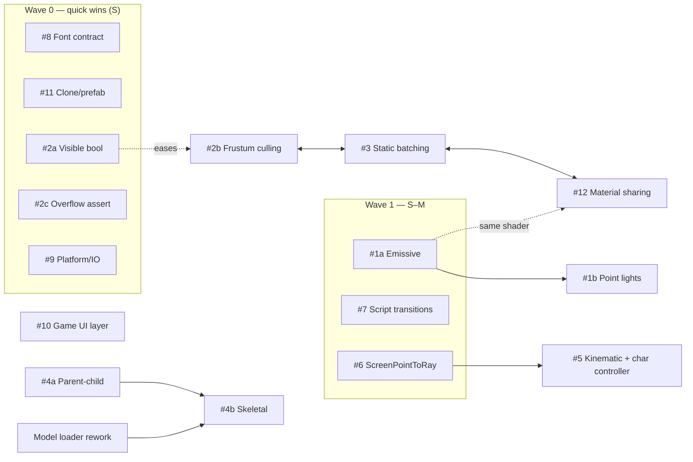

# Engine Improvement Backlog — Gloomdelve-driven

Companion to [ROADMAP.md](ROADMAP.md). Where `ROADMAP.md` is the **milestone narrative** (what
game each version ships), this is the **friction backlog**: 12 engine gaps surfaced while building
the Gloomdelve dungeon crawler on prebuilt DingoEngine **v0.4.2**, prioritized by how much
*game* code each one deletes, then sequenced by dependency + effort.

- **Verified** against the tree on 2026-07-02 (engine `VERSION` = 0.4.2). Every claim below has a
  `file:line` anchor from that pass — re-confirm before implementing, code drifts.
- **Delivery model:** Gloomdelve consumes the engine as a **prebuilt release** (lib + headers +
  vendor DLLs) and re-links. Every item here therefore ships as a *new engine release* the game
  re-links against — so **batch items into releases** (see §5), don't trickle them one at a time.
- Effort scale (rough): **S** ≤1 day · **M** 2–4 days · **L** 1–2 weeks · **XL** 3+ weeks.

---

## 1. Verified state — the facts this plan rests on

| Subsystem | Confirmed fact | Anchor |
|---|---|---|
| Renderer3D | CPU-transforms **every vertex every frame**; no per-instance model matrix | `Renderer3D.cpp:221` |
| Renderer3D | `MaxVertices=65536`; overflow = **silent drop + one-time WARN** (no assert, no auto-flush) | `Renderer3D.cpp:209`, `.h:26` |
| Renderer3D | **No GPU instancing / static batching** — batch cleared & re-uploaded each frame | `Renderer3D.cpp:138,174` |
| Renderer3D | `CommandList::DrawIndexed` takes `instanceCount` but it's hardcoded to `1` | `Renderer.cpp:291`, `CommandList.h:46` |
| Renderer3D | **No frustum/distance culling** anywhere; every mesh submitted unconditionally | `Scene.cpp:297` |
| Lighting | **Directional only, one per scene** (first found wins); no point/spot lights exist | `SceneRenderer.cpp:55`, `Components.h:148` |
| Lighting | **No emissive channel** in Material or the lit shader | `Material.h:13`, `Renderer3D.cpp:11` |
| MeshRenderer | **No `Visible`/`Enabled` bool** — only `Mesh`/`Color`/`Material`; cull = null the `Mesh` | `Components.h:264,303` |
| Materials | Per-`Material*` batching; **`nullptr` → shared built-in default batch** (first custom material fragments batches) | `Renderer3D.cpp:204` |
| Materials | UBO layout: scene@0 / material@1 / textures+samplers interleaved from 2 | `Material.cpp:153` |
| Physics3D | Live-body control = `SetLinearVelocity` + `ApplyImpulse`/`ApplyForce` **only**; position/rotation **read-only** | `Physics3D.h:75–82` |
| Physics3D | **No `SetPosition`/`Teleport`**; `BodyType3D::Kinematic` exists but nothing can reposition it; no capsule shape; no character controller | `Physics3D.h`, `PhysicsTypes3D.h:15,18` |
| Scene | `SceneManager::SetActiveScene` transitions (stop→start); **`ScriptableEntity` can't reach `SceneManager`** — only its own `Scene` | `SceneManager.h:37`, `ScriptableEntity.h:24` |
| Font | `Font::Create` **never returns nullptr** — on a missing file it logs then continues with **uninitialized `width/height`** → garbage atlas; **no `IsValid()`**; path is CWD-relative | `Font.cpp:75,88,132,254` |
| Model | `LoadFromFile` **does** return nullptr on failure — *inconsistent* with `Font::Create` | `Model.h:22` |
| ECS | Copy-landmine documented verbatim (2D→reset `0`, 3D→reset `k_InvalidBody3D`); **no clone/duplicate/prefab API exists at all** | `Components.h:173,197,217,293` |
| ECS | `Model::LoadFromFile` **static-only** (no bones/skinning); **no `Parent` component / hierarchy** — transforms are flat world-space | `Model.h`, `Components.h:236` |
| Platform | **No `Dingo::Platform`/`Dingo::IO`**; closest is `Dingo::CacheManager` (cache dirs only) | `CacheManager.h` |
| UI | `Dingo::UI` is a **thin immediate-mode ImGui passthrough** gated behind `Layer::OnUIRender()`; no retained widgets, anchors, or hit-testing | `UI.h`, `ImGuiUI.cpp` |
| Text | MSDF atlas charset **U+0020–U+00FF**, rendered **byte-wise, no UTF-8 decode** | `Font.cpp:258,159` |

---

## 2. Reconciliation with ROADMAP.md

The 12 items fall into three buckets against the existing milestone plan:

**Already committed to v0.5** (don't double-plan — fold the game-side work into that milestone):
- **#5** kinematic control + capsule character controller → *ROADMAP.md:76* ("character controller … capsule plus ground/step handling … per-body position/angular control `Physics3D` still lacks").
- **#6** ray/shape casts → *ROADMAP.md:76* ("ray and shape casts for melee hits and line-of-sight").

**Already deferred** (leave parked):
- **#4b** full skeletal animation → *ROADMAP.md:67–70* ("proper skeletal-animation system … slated to land with the character fidelity push of v0.5+").
- **#1 "bloom later"** → *ROADMAP.md:96* (v0.9 Advanced Rendering: shadows, bloom, tone mapping).

**Net-new / unscheduled** — the real contribution of this doc, these have no home yet:
**#1** point lights + emissive, **#2** culling + `Visible`, **#3** static batching/instancing, **#4a**
parent-child transforms, **#7** script scene-transitions, **#8** Font contract, **#9** Platform/IO,
**#10** UI layer, **#11** clone/prefab, **#12** material sharing + UTF-8.

> ⚠️ **The single biggest game pain — #1 point lights (~330–380 lines of CPU torch-faking) — is
> NOT on the engine roadmap.** Recommend adding an explicit **Lighting** milestone (point lights +
> emissive) landing *with or just before* the v0.5 game, so the game can delete the torch hack;
> bloom then follows naturally in v0.9.

---

## 3. The 12 items at a glance

| # | Item | Effort | Deletes in Gloomdelve | ROADMAP status |
|---|---|---|---|---|
| 1 | Point lights + emissive | 1a emissive **M** · 1b point lights **L** | ~330–380 lines (~40% of `GameController.cpp`) of torch-faking | **unscheduled** (bloom=v0.9) |
| 2 | Culling + `Visible` flag | 2a `Visible` **S** · 2b frustum **M–L** · 2c overflow assert **S** | ~50 lines mesh-nulling + restore arrays (2 systems) | unscheduled |
| 3 | Static batching / instancing | **L–XL** | the `VIS_CULL_RADIUS` vertex-budget workaround | unscheduled |
| 4 | Skeletal / parent-child | 4a parent-child **M–L** · 4b skeletal **XL** | 4a: most of `CharacterRig::Update` (76 lines) + `export_chars.py` pivot math | **4b=v0.5+**; 4a unscheduled |
| 5 | Physics3D kinematic + char controller | **M–L** | raw-velocity movement; unblocks warp/checkpoint/respawn | **v0.5-committed** |
| 6 | `ScreenPointToRay` / ground raycast | **S–M** | `MouseGroundPoint` hand-inverted VP (37 lines) | **v0.5-committed** |
| 7 | Script-accessible scene transitions | **S–M** | `GameSession::SceneRequest` + `main.cpp` pump (~40 lines) | unscheduled (≈v0.7) |
| 8 | `Font::Create` failure contract | **S** | de-risks CWD trap; game's dead nullptr-guard becomes real | unscheduled (asset-root≈v0.6) |
| 9 | Platform/IO helpers | **S** | `SaveGame.cpp` `getenv`/`#ifdef` + non-atomic write (~15 lines) | unscheduled |
| 10 | Game-facing UI layer | **M–L** | hand-rolled hit-testing across ~4 files | unscheduled |
| 11 | Clone/prefab that resets handles | **S–M** | closes documented double-free; net-new capability | unscheduled |
| 12 | Material sharing + UTF-8 text | material **M** · UTF-8 **S** | batch fragmentation once custom materials appear; ASCII-only constraint | unscheduled |

---

## 4. Build order (dependency-sequenced)

Waves are ordered; items **within** a wave are independent and can go in parallel. Splits (1a/1b,
2a/2b, 4a/4b) are the whole point — the cheap half ships early, the expensive half waits.

### Wave 0 — Quick wins · all **S** · no dependencies
The near-free batch. Each is hours, and together they delete the ugliest game code and close two
latent bugs. Ship as a **v0.4.3** cleanup point-release.
- **#8 Font contract** — make `Font::Create` return `nullptr` on load failure (fixing the
  uninitialized-`width/height` UB), add `IsValid()`, keep the error log. Aligns it with
  `Model::LoadFromFile`. Turns the game's currently-dead `if (!s_Font)` guard into a real one.
- **#11 Clone/prefab API** — a `Scene::DuplicateEntity` that deep-copies components and **resets
  `RuntimeBody`/shape handles to their sentinels** (`0` / `k_InvalidBody3D`). The landmine is
  already documented in `Components.h`; this just owns the reset. Net-new capability too.
- **#2a `Visible` bool** on `MeshRendererComponent` — `RenderEntities3D` checks it. Deletes the
  `Mesh = nullptr` juggling + the `m_WallMeshes`/`m_FloorTileMeshes`/`Prop::M` restore arrays and
  `CharacterRig::SetVisible`.
- **#2c overflow assert** — the WARN already exists; add an opt-in assert/hard-fail so a blown
  `MaxVertices` budget can't ship silently.
- **#9 Platform/IO** — `GetUserDataDir(appName)` + `WriteFileAtomic(path, contents)`, extending the
  `CacheManager` precedent. Deletes `SaveGame.cpp`'s `getenv("LOCALAPPDATA")`/`#ifdef _WIN32` and
  its non-atomic truncate-in-place write (a real corruption risk, not just cleanup).

### Wave 1 — Emissive + script ergonomics · **S–M**
- **#1a Emissive channel** — an emissive color/strength on the lit shader + material param. Kills
  the "push albedo to 5.0/7.5 so it clamps to a glow" trick (`COLOR_TORCH_FLAME`/`COLOR_TORCH_CORE`)
  and `PartDef::Emissive`, *independent of point lights*. Additive shader term — not thrown away
  when #1b lands (accepted: the lit shader gets touched twice; the early relief is worth it).
- **#7 Script scene-transitions** — let a `ScriptableEntity` request a switch (a request queue on
  `Scene` the `SceneManager` drains each frame, or a manager back-pointer). Deletes the
  `GameSession::SceneRequest` enum + `main.cpp` `ProcessRequest` pump — a channel *every* DingoEngine
  game will otherwise re-invent.
- **#6 `ScreenPointToRay` + ground-plane helper** — v0.5-committed and trivial; do it early. Deletes
  `MouseGroundPoint`'s hand-inverted view-projection, and **unblocks #5** (shapecast/ground tests).

### Wave 2 — Gameplay physics · **M–L** · v0.5 core
- **#5 Kinematic control + character controller** — `SetPosition`/`SetRotation`/teleport on live
  bodies; a **capsule** collider (only Box/Sphere exist today); a capsule controller wrapping Jolt's
  unused `CharacterVirtual`. v0.5-committed. Replaces wholesale-velocity movement and enables
  checkpoints/teleporters/respawn. Depends on the capsule shape; benefits from #6.

### Wave 3 — The Lighting milestone · **L** · the biggest single win (currently unscheduled)
- **#1b Point lights** — a capped forward **N-light** budget: a `PointLightComponent`, collect the
  N nearest in `SceneRenderer`, pass an array through the scene UBO (binding 0, the layout reworked
  in v0.4.2), loop with distance attenuation in the fragment shader. No shadows (that's v0.9).
  Deletes the remaining **~250–300 lines** of `TorchPoolLight` / `UpdateTorches` lighting /
  per-frame albedo rewrites on walls/floors/props/treasure. Do **after #1a** (reuse the shader work).

### Wave 4 — Rendering scale · **L–XL** · when perf bites (v0.9-adjacent)
Design #3 and #2b **together** — they're one story (the cull-radius layer is a vertex-budget valve).
- **#3 Static batching / instancing** — persistent/pre-baked buffers for never-moving walls & floor
  slabs, or instance identical variants (the `instanceCount` plumbing already exists at
  `CommandList` level). Retires the `VIS_CULL_RADIUS` workaround at the source.
- **#2b Frustum/distance culling** — narrows the submitted set; complements #3.
- **#12 Material sharing/cache** — a shared-material pattern so the first custom material doesn't
  fragment the single-batch fast path. Couple with the #1/#3 shader churn. Sub-item **UTF-8 decode**
  (**S**) lifts the ASCII-only text constraint — low priority; the game just stays ASCII today.

### Wave 5 — Character fidelity · v0.5+
- **#4a Parent-child transforms** (**M–L**) — a `Parent` component + a transform-propagation pass.
  Collapses most of `CharacterRig::Update` (76 lines of per-part world math) and the
  `export_chars.py` pivot reverse-engineering. Independent ECS feature — **pull earlier** if rig
  pain is acute; it does not need the skeletal work.
- **#4b Skeletal animation** (**XL**) — skinned meshes, clips, blend tree; requires reworking the
  static-only `Model::LoadFromFile`. Already parked at v0.5+; pairs with the v0.6 asset pipeline.

---

## 5. Suggested release grouping

| Release | Contents | Rationale |
|---|---|---|
| **v0.4.3** (cleanup) | Wave 0: #8, #11, #2a, #2c, #9 | All **S**, no deps; ships fast, deletes the ugliest game code + closes 2 latent bugs |
| **v0.5 supporting** | #6, #5 (both committed) + #7 + #1a | Makes the v0.5 game buildable without the worst hacks |
| **Lighting** (propose ~v0.5.x) | #1b point lights | Biggest deletion; **add to the roadmap** — it isn't there |
| **v0.6-adjacent** | #8 asset-root story folds into `AssetManager`; #9 fits too | Asset pipeline is the natural home |
| **Rendering-scale** (~v0.9) | #3, #2b, #12 | v0.9 is Advanced Rendering & Performance |
| **v0.5+ fidelity** | #4a (pull earlier if needed), then #4b | Character-fidelity push |

---

## 6. Dependency graph

Plain-text edges (for terminal viewing): #6→#5 · #1a→#1b · #2a eases #2b · #2b↔#3↔#12 (co-design) ·
#1a shares shader work with #12 · #4a→#4b (and #4b needs the Model-loader rework). Independent, no
deps: **#7, #8, #9, #10, #11**.

---

## 7. Corrections to the roadmap's assumptions

Things the verification pass changed or sharpened vs. the original 12-item write-up:

- **#2's "silent dropping" is already a WARN.** `MaxVertices` overflow logs a one-time warning
  today (`Renderer3D.cpp:209`) — the real ask is an **assert/hard-fail option** + the `Visible` bool,
  not "add a warning."
- **#8 is worse than "silent nullptr."** `Font::Create` returns a **broken object with uninitialized
  `width/height`** (latent UB), and the game already carries a **dead** `if (!s_Font)` guard for a
  null the engine never returns. Also `Model::LoadFromFile` *does* return nullptr — **align the two**.
- **#1 (point lights) is not on the engine roadmap** — the biggest single win is unscheduled. Add it.
- **#5 and #6 are already v0.5-committed** — treat them as *game-side adoption of planned engine
  work*, not net-new backlog.
- **Instancing has a foothold** — `CommandList` already exposes `instanceCount`, lowering #3's floor
  a little (the hard part is persistent buffers, not the draw call).
- **#10 must escape the debug pass** — `Dingo::UI` is gated behind `Layer::OnUIRender()`, so a
  game HUD can't reuse it as-is; the new layer has to be usable from normal scene rendering.
- **Text ASCII-only is undocumented discipline, not an enforced rule** — no game-side comment states
  it; 100% of on-screen strings just happen to be ASCII (footers pad with spaces instead of em-dash).
  The byte-wise engine render is confirmed, so the constraint is real — #12's UTF-8 half is genuine
  but low-signal.
- **CharacterRig is 13–24 entities/char**, slightly under the roadmap's "15–24" (Wizard=13).
