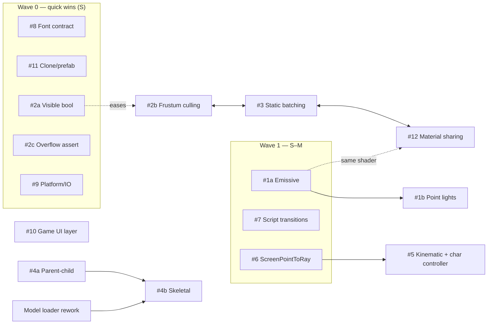

# Engine Improvement Backlog — Gloomdelve-driven

Companion to [ROADMAP.md](ROADMAP.md). Where `ROADMAP.md` is the **milestone narrative** (what
game each version ships), this is the **friction backlog**: 12 engine gaps surfaced while building
the Gloomdelve dungeon crawler on prebuilt DingoEngine **v0.4.2**, prioritized by how much
*game* code each one deletes, then sequenced by dependency + effort. §8 adds the six that *Marionette*
found in v0.8.

- **Verified** against the tree on 2026-07-02 (engine `VERSION` = 0.4.2). Every claim below has a
  `file:line` anchor from that pass — re-confirm before implementing, code drifts.
- **Status** (the bold "landed vX.Y" notes) re-checked against **v0.8.2** on 2026-10-06; the
  anchors were not. Of the 12, only **#2b**, **#3**, **#10** and **#12**'s material half are still
  open, and §8's six are all open.
- **Delivery model:** Gloomdelve consumes the engine as a **prebuilt release** (lib + headers +
  vendor DLLs) and re-links. Every item here therefore ships as a *new engine release* the game
  re-links against — so **batch items into releases** (see §5), don't trickle them one at a time.
- Effort scale (rough): **S** ≤1 day · **M** 2–4 days · **L** 1–2 weeks · **XL** 3+ weeks.

---

## 1. Verified state — the facts this plan rests on

| Subsystem | Confirmed fact | Anchor |
|---|---|---|
| Renderer3D | CPU-transforms **every vertex every frame**; no per-instance model matrix | `Renderer3D.cpp:221` |
| Renderer3D | `MaxVertices=65536`; overflow = **silent drop + one-time WARN** (no assert, no auto-flush) — **v0.4.3: opt-in `Renderer3DCapabilities::AssertOnOverflow`; v0.6.3: overflow spills into another batch** | `Renderer3D.cpp:209`, `.h:26` |
| Renderer3D | **No GPU instancing / static batching** — batch cleared & re-uploaded each frame | `Renderer3D.cpp:138,174` |
| Renderer3D | `CommandList::DrawIndexed` takes `instanceCount` but it's hardcoded to `1` | `Renderer.cpp:291`, `CommandList.h:46` |
| Renderer3D | **No frustum/distance culling** anywhere; every mesh submitted unconditionally — **v0.7: point and spot lights are frustum-culled; meshes still are not** | `Scene.cpp:297` |
| Lighting | **Directional only, one per scene** (first found wins); no point/spot lights exist — **v0.7: up to 4 directional lights plus 32 point/spot lights in view, as components or `Renderer3D::SubmitLight`** | `SceneRenderer.cpp:55`, `Components.h:148` |
| Lighting | **No emissive channel** in Material or the lit shader — **v0.5: emissive colour and strength on `Material`; v0.7: roughness, specular and an albedo map on any `CreateLitMaterial` material** | `Material.h:13`, `Renderer3D.cpp:11` |
| MeshRenderer | **No `Visible`/`Enabled` bool** — only `Mesh`/`Color`/`Material`; cull = null the `Mesh` — **v0.4.3: `MeshRendererComponent::Visible`** | `Components.h:264,303` |
| Materials | Per-`Material*` batching; **`nullptr` → shared built-in default batch** (first custom material fragments batches) | `Renderer3D.cpp:204` |
| Materials | UBO layout: scene@0 / material@1 / textures+samplers interleaved from 2 | `Material.cpp:153` |
| Physics3D | Live-body control = `SetLinearVelocity` + `ApplyImpulse`/`ApplyForce` **only**; position/rotation **read-only** — **v0.5: `SetPosition`/`SetRotation`/`SetPositionAndRotation` and `MoveKinematic`** | `Physics3D.h:75–82` |
| Physics3D | **No `SetPosition`/`Teleport`**; `BodyType3D::Kinematic` exists but nothing can reposition it; no capsule shape; no character controller — **v0.5: all three (teleports, `ColliderShape3D::Capsule`, `CharacterController3D`)** | `Physics3D.h`, `PhysicsTypes3D.h:15,18` |
| Scene | `SceneManager::SetActiveScene` transitions (stop→start); **`ScriptableEntity` can't reach `SceneManager`** — only its own `Scene` — **v0.5: `ScriptableEntity::RequestSceneTransition`, drained by `SceneManager`** | `SceneManager.h:37`, `ScriptableEntity.h:24` |
| Font | `Font::Create` **never returns nullptr** — on a missing file it logs then continues with **uninitialized `width/height`** → garbage atlas; **no `IsValid()`**; path is CWD-relative — **v0.4.3: `nullptr` on failure + `IsValid()`; v0.6.3: a relative path tries the asset root first** | `Font.cpp:75,88,132,254` |
| Model | `LoadFromFile` **does** return nullptr on failure — *inconsistent* with `Font::Create` — **v0.4.3: consistent** | `Model.h:22` |
| ECS | Copy-landmine documented verbatim (2D→reset `0`, 3D→reset `k_InvalidBody3D`); **no clone/duplicate/prefab API exists at all** — **v0.4.3: `Scene::DuplicateEntity` resets the handles; v0.6.3: handles moved off the public components; v0.7.1: it copies the subtree. Still no prefab API** | `Components.h:173,197,217,293` |
| ECS | `Model::LoadFromFile` **static-only** (no bones/skinning); **no `Parent` component / hierarchy** — transforms are flat world-space — v0.7.1: parenting; v0.8: skinned models, skeletons and clips | `Model.h`, `Components.h:236` |
| Platform | **No `Dingo::Platform`/`Dingo::IO`**; closest is `Dingo::CacheManager` (cache dirs only) — **v0.4.3: `Platform::GetUserDataDir`, `IO::WriteFileAtomic`; v0.6.2: `GetExecutablePath`/`GetExecutableDirectory`/`FindDirectoryUpward`** | `CacheManager.h` |
| UI | `Dingo::UI` is a **thin immediate-mode ImGui passthrough** gated behind `Layer::OnUIRender()`; no retained widgets, anchors, or hit-testing | `UI.h`, `ImGuiUI.cpp` |
| Text | MSDF atlas charset **U+0020–U+00FF**, rendered **byte-wise, no UTF-8 decode** — **v0.6.2: UTF-8 decode; the atlas adds General Punctuation and €** | `Font.cpp:258,159` |

---

## 2. Reconciliation with ROADMAP.md

The 12 items fall into three buckets against the existing milestone plan:

**Committed to v0.5, and landed there** (the game-side work was folded into that milestone):
- **#5** kinematic control + capsule character controller → *ROADMAP.md* v0.5 ("character controller … capsule plus ground/step handling … per-body position/angular control `Physics3D` previously lacked").
- **#6** ray/shape casts → *ROADMAP.md* v0.5 ("ray and shape casts for melee hits and line-of-sight").

**Already deferred** (leave parked):
- **#1 "bloom later"** → v0.9 Advanced Rendering: shadows, bloom, tone mapping.

**Now scheduled** (were deferred or homeless when this doc was written):
- **#4a** parent-child transforms **shipped as v0.7.1**, pulled forward from v0.8 as the
  independently-useful half. **#4b** full skeletal animation **shipped as v0.8.0 — Animation &
  Character Fidelity** (2026-10-05), so v0.4.2's "slated to land with the character fidelity push
  of v0.5+" note is finally kept.
- **#2b** frustum/distance culling, **#3** static batching/instancing and **#12** material sharing are
  **v1.0 — Stability, Performance & Polish**. v0.9 shed its "& Performance" half to become purely
  visual, so the throughput work moved to v1.0 rather than staying "v0.9-adjacent". Still planned.

**Net-new / unscheduled** — the real contribution of this doc, these had no home when it was written:
**#8** Font contract, **#9** Platform/IO, **#10** UI layer, **#11** clone/prefab, and #12's **UTF-8
decode** sub-item. (#8, #9, #11 and #2a's `Visible` bool all shipped in **v0.4.3** and UTF-8 in
**v0.6.2** — see §3; the genuinely homeless one is **#10**, the game-facing UI layer.)

> ✅ **Adopted, and shipped as v0.7.0 (2026-10-01): #1 point lights became the v0.7 milestone.**
> This doc's headline recommendation — that the single biggest game pain (~330–380 lines of CPU
> torch-faking) had no home on the roadmap — was taken up when scripting moved out of the v0.7 slot
> to an out-of-band module. *ROADMAP.md* v0.7 became **Lighting & Shading**: point + spot lights
> on a capped forward N-light budget, colour and intensity on the directional light, a specular
> term, and the lit shader moved onto the hot-reloadable file path. #1a emissive already landed in
> **v0.5**; bloom still follows in v0.9.

---

## 3. The 12 items at a glance

| # | Item | Effort | Deletes in Gloomdelve | ROADMAP status |
|---|---|---|---|---|
| 1 | Point lights + emissive | 1a emissive **M** · 1b point lights **L** | ~330–380 lines (~40% of `GameController.cpp`) of torch-faking | 1a **landed v0.5** · 1b **landed v0.7.0** (bloom=v0.9) |
| 2 | Culling + `Visible` flag | 2a `Visible` **S** · 2b frustum **M–L** · 2c overflow assert **S** | ~50 lines mesh-nulling + restore arrays (2 systems) | 2a, 2c **landed v0.4.3** · 2b v1.0 |
| 3 | Static batching / instancing | **L–XL** | the `VIS_CULL_RADIUS` vertex-budget workaround | v1.0 |
| 4 | Skeletal / parent-child | 4a parent-child **M–L** · 4b skeletal **XL** | 4a: most of `CharacterRig::Update` (76 lines) + `export_chars.py` pivot math | 4a **landed v0.7.1** · 4b **landed v0.8** |
| 5 | Physics3D kinematic + char controller | **M–L** | raw-velocity movement; unblocks warp/checkpoint/respawn | **landed v0.5** |
| 6 | `ScreenPointToRay` / ground raycast | **S–M** | `MouseGroundPoint` hand-inverted VP (37 lines) | **landed v0.5** |
| 7 | Script-accessible scene transitions | **S–M** | `GameSession::SceneRequest` + `main.cpp` pump (~40 lines) | **landed v0.5** |
| 8 | `Font::Create` failure contract | **S** | de-risks CWD trap; game's dead nullptr-guard becomes real | **landed v0.4.3** · asset root v0.6.0, raw factories v0.6.3 |
| 9 | Platform/IO helpers | **S** | `SaveGame.cpp` `getenv`/`#ifdef` + non-atomic write (~15 lines) | **landed v0.4.3** |
| 10 | Game-facing UI layer | **M–L** | hand-rolled hit-testing across ~4 files | unscheduled |
| 11 | Clone/prefab that resets handles | **S–M** | closes documented double-free; net-new capability | duplicate **landed v0.4.3**; no prefab API |
| 12 | Material sharing + UTF-8 text | material **M** · UTF-8 **S** | batch fragmentation once custom materials appear; ASCII-only constraint | UTF-8 **landed v0.6.2**; material sharing v1.0 |

---

## 4. Build order (dependency-sequenced)

Waves are ordered; items **within** a wave are independent and can go in parallel. Splits (1a/1b,
2a/2b, 4a/4b) are the whole point — the cheap half ships early, the expensive half waits.

### Wave 0 — Quick wins · all **S** · no dependencies — **shipped v0.4.3**
The near-free batch. Each is hours, and together they delete the ugliest game code and close two
latent bugs. All five shipped together as the **v0.4.3** cleanup point-release.
- **#8 Font contract** — make `Font::Create` return `nullptr` on load failure (fixing the
  uninitialized-`width/height` UB), add `IsValid()`, keep the error log. Aligns it with
  `Model::LoadFromFile`. Turns the game's currently-dead `if (!s_Font)` guard into a real one.
- **#11 Clone/prefab API** — a `Scene::DuplicateEntity` that deep-copies components and **resets
  `RuntimeBody`/shape handles to their sentinels** (`0` / `k_InvalidBody3D`). The landmine is
  already documented in `Components.h`; this just owns the reset. Net-new capability too.
- **#2a `Visible` bool** on `MeshRendererComponent` — `RenderEntities3D` checks it. Deletes the
  `Mesh = nullptr` juggling + the `m_WallMeshes`/`m_FloorTileMeshes`/`Prop::M` restore arrays and
  `CharacterRig::SetVisible`.
- **#2c overflow assert** — the WARN already exists; add an opt-in assert/hard-fail so a blown
  `MaxVertices` budget can't ship silently.
- **#9 Platform/IO** — `GetUserDataDir(appName)` + `WriteFileAtomic(path, contents)`, extending the
  `CacheManager` precedent. Deletes `SaveGame.cpp`'s `getenv("LOCALAPPDATA")`/`#ifdef _WIN32` and
  its non-atomic truncate-in-place write (a real corruption risk, not just cleanup).

### Wave 1 — Emissive + script ergonomics · **S–M** — **shipped v0.5**
- **#1a Emissive channel** — an emissive color/strength on the lit shader + material param. Kills
  the "push albedo to 5.0/7.5 so it clamps to a glow" trick (`COLOR_TORCH_FLAME`/`COLOR_TORCH_CORE`)
  and `PartDef::Emissive`, *independent of point lights*. Additive shader term — not thrown away
  when #1b lands (accepted: the lit shader gets touched twice; the early relief is worth it).
- **#7 Script scene-transitions** — let a `ScriptableEntity` request a switch (a request queue on
  `Scene` the `SceneManager` drains each frame, or a manager back-pointer). Deletes the
  `GameSession::SceneRequest` enum + `main.cpp` `ProcessRequest` pump — a channel *every* DingoEngine
  game will otherwise re-invent.
- **#6 `ScreenPointToRay` + ground-plane helper** — v0.5-committed and trivial; do it early. Deletes
  `MouseGroundPoint`'s hand-inverted view-projection, and **unblocks #5** (shapecast/ground tests).

### Wave 2 — Gameplay physics · **M–L** · v0.5 core — **shipped v0.5**
- **#5 Kinematic control + character controller** — `SetPosition`/`SetRotation`/teleport on live
  bodies; a **capsule** collider (only Box/Sphere exist today); a capsule controller wrapping Jolt's
  unused `CharacterVirtual`. v0.5-committed. Replaces wholesale-velocity movement and enables
  checkpoints/teleporters/respawn. Depends on the capsule shape; benefits from #6.

### Wave 3 — The Lighting milestone · **L** · the biggest single win — **shipped v0.7.0**
- **#1b Point lights** — a capped forward **N-light** budget: a `PointLightComponent`, collect the
  N nearest in `SceneRenderer`, pass an array through the scene UBO (binding 0, the layout reworked
  in v0.4.2), loop with distance attenuation in the fragment shader. No shadows (that's v0.9).
  Deletes the remaining **~250–300 lines** of `TorchPoolLight` / `UpdateTorches` lighting /
  per-frame albedo rewrites on walls/floors/props/treasure. Do **after #1a** (reuse the shader work).

### Wave 4 — Rendering scale · **L–XL** · when perf bites — **planned for v1.0**
Design #3 and #2b **together** — they're one story (the cull-radius layer is a vertex-budget valve).
- **#3 Static batching / instancing** — persistent/pre-baked buffers for never-moving walls & floor
  slabs, or instance identical variants (the `instanceCount` plumbing already exists at
  `CommandList` level). Retires the `VIS_CULL_RADIUS` workaround at the source.
- **#2b Frustum/distance culling** — narrows the submitted set; complements #3.
- **#12 Material sharing/cache** — a shared-material pattern so the first custom material doesn't
  fragment the single-batch fast path. Couple with the #1/#3 shader churn. Sub-item **UTF-8 decode**
  (**S**) lifts the ASCII-only text constraint — **landed in v0.6.2**.

### Wave 5 — Character fidelity — **shipped v0.7.1 + v0.8.0**
- **#4a Parent-child transforms** (**M–L**) — **landed v0.7.1**, pulled earlier as this item
  suggested: `Entity::SetParent` and world transforms computed through the parent chain (once per
  pass for the engine's readers). Collapses most of `CharacterRig::Update` (76 lines of per-part
  world math) and the `export_chars.py` pivot reverse-engineering; DungeonCrawler3D's character rig
  already lost its per-part world maths. It did not need the skeletal work.
- **#4b Skeletal animation** (**XL**) — skinned meshes, clips, blend tree; requires reworking the
  static-only `Model::LoadFromFile`. **Shipped as v0.8.0's engine work** (GPU skinning, the animator,
  blending, layers, timeline events, sockets, in-place model hot-reload); pairs with the v0.6 asset
  pipeline, which is what makes the loader rework affordable (rigs become `AssetManager`-owned
  assets).

---

## 5. Suggested release grouping

| Release | Contents | Rationale | Status |
|---|---|---|---|
| **v0.4.3** (cleanup) | Wave 0: #8, #11, #2a, #2c, #9 | All **S**, no deps; ships fast, deletes the ugliest game code + closes 2 latent bugs | **Shipped** |
| **v0.5 supporting** | #6, #5 (both committed) + #7 + #1a | Makes the v0.5 game buildable without the worst hacks | **Shipped** in v0.5.0 |
| **v0.7 Lighting & Shading** | #1b point lights (+ spot, light colour/intensity, specular) | Biggest deletion; took over the v0.7 slot when scripting became a module | **Shipped** in v0.7.0 |
| **v0.6-adjacent** | #8 asset-root story folds into `AssetManager`; #9 fits too | Asset pipeline is the natural home | **Shipped**: the `AssetManager` root in v0.6.0, the raw factories on it in v0.6.3 (#8's contract and #9 itself were v0.4.3) |
| **v1.0 Stability, Performance & Polish** | #3, #2b, #12 | v0.9 became purely visual (shadows/post/VFX), so the throughput work moved to v1.0 — where there is finally a full frame to measure | Planned |
| **v0.7.1 Transform Hierarchy** | #4a | The independently-useful half, pulled forward from v0.8 | **Shipped** |
| **v0.8 Animation & Character Fidelity** | #4b | Character-fidelity push; honours v0.4.2's unkept "v0.5+" promise | **Shipped** in v0.8.0 |

---

## 6. Dependency graph

```mermaid
graph LR
  subgraph Wave0["Wave 0 — quick wins (S)"]
    F8[#8 Font contract]
    E11[#11 Clone/prefab]
    V2a[#2a Visible bool]
    A2c[#2c Overflow assert]
    IO9[#9 Platform/IO]
  end
  subgraph Wave1["Wave 1 — S–M"]
    EM1a[#1a Emissive]
    SC7[#7 Script transitions]
    RAY6[#6 ScreenPointToRay]
  end
  RAY6 --> PHY5[#5 Kinematic + char controller]
  EM1a --> PL1b[#1b Point lights]
  V2a -.eases.-> CULL2b[#2b Frustum culling]
  CULL2b <--> BATCH3[#3 Static batching]
  BATCH3 <--> MAT12[#12 Material sharing]
  EM1a -.same shader.-> MAT12
  PC4a[#4a Parent-child] --> SKEL4b[#4b Skeletal]
  MODEL[Model loader rework] --> SKEL4b
  UI10[#10 Game UI layer]
```

Plain-text edges (for terminal viewing): #6→#5 · #1a→#1b · #2a eases #2b · #2b↔#3↔#12 (co-design) ·
#1a shares shader work with #12 · #4a→#4b (and #4b needs the Model-loader rework). Independent, no
deps: **#7, #8, #9, #10, #11**.

As of v0.8.2 every node has shipped except **#2b ↔ #3 ↔ #12** (v1.0) and **#10** (unscheduled).

---

## 7. Corrections to the roadmap's assumptions

Things the verification pass changed or sharpened vs. the original 12-item write-up:

- **#2's "silent dropping" is already a WARN.** `MaxVertices` overflow logs a one-time warning
  today (`Renderer3D.cpp:209`) — the real ask is an **assert/hard-fail option** + the `Visible` bool,
  not "add a warning." ✅ Both landed in v0.4.3 (`Renderer3DCapabilities::AssertOnOverflow`,
  default off); since v0.6.3 an overflow spills into another batch.
- **#8 is worse than "silent nullptr."** `Font::Create` returns a **broken object with uninitialized
  `width/height`** (latent UB), and the game already carries a **dead** `if (!s_Font)` guard for a
  null the engine never returns. Also `Model::LoadFromFile` *does* return nullptr — **align the two**.
  ✅ Aligned in v0.4.3: `Font::Create` returns `nullptr` and gained `IsValid()`.
- **#1 (point lights) was not on the engine roadmap** — the biggest single win was unscheduled.
  ✅ Resolved: shipped as **v0.7.0 Lighting & Shading**.
- **#5 and #6 are already v0.5-committed** — treat them as *game-side adoption of planned engine
  work*, not net-new backlog. ✅ Both landed in v0.5.
- **Instancing has a foothold** — `CommandList` already exposes `instanceCount`, lowering #3's floor
  a little (the hard part is persistent buffers, not the draw call).
- **#10 must escape the debug pass** — `Dingo::UI` is gated behind `Layer::OnUIRender()`, so a
  game HUD can't reuse it as-is; the new layer has to be usable from normal scene rendering.
- **Text ASCII-only is undocumented discipline, not an enforced rule** — no game-side comment states
  it; 100% of on-screen strings just happen to be ASCII (footers pad with spaces instead of em-dash).
  The byte-wise engine render is confirmed, so the constraint is real — #12's UTF-8 half is genuine
  but low-signal. ✅ UTF-8 decode landed in v0.6.2.
- **CharacterRig is 13–24 entities/char**, slightly under the roadmap's "15–24" (Wizard=13).

---

## 8. Found by Marionette (v0.8)

Gaps the *Marionette* example hit while building a duel on the v0.8 animation engine (its plan,
`.claude/plans/2026-10-03-marionette-plan.md` §10, has the detail). None blocked the game, and each
was worked round on the game side. They are not among the 12 items above and are unscheduled; the
effort scale is the one at the top.

| Item | Effort | What Marionette does instead |
|---|---|---|
| **Embedded model textures.** `Model::LoadFromFile` returns no texture for an image embedded in a GLB (`Model.cpp`, `LoadDiffuseTexture` skips `*N` paths), with no warning, and most glTF packs embed theirs. Fix: decode the `aiTexture` data (`stbi_load_from_memory`) and key the texture cache by model path and index, so hot-reload still matches it | **S–M** | Ships the PNGs KayKit also provides and gives each fighter a lit material with its PNG on slot 0 |
| **Clips-only loading of a clip library that carries a preview mesh.** KayKit's libraries hold the mannequin, so each loads its six skinned meshes and never draws them. A load option that skips meshes would stop the cost | **S** | Loads them whole and ignores the meshes |
| **Character-vs-character collision.** `CharacterController3D` is a Jolt `CharacterVirtual`, not a body, and no `CharacterVsCharacterCollision` is set up, so two controllers walk through each other | **M** | Removes the closing speed between the fighters in game code |
| **Sensors, cast filters and a body → entity lookup.** There are no trigger volumes, no ignore-body or layer filters on `RayCast` / `ShapeCastSphere` / `OverlapSphere`, and no way to get from a hit body back to its entity. A controller is not a body, so no cast ever hits a fighter, and a body on a socket would shove the other fighter's controller. Candlewick listed the same three | **M** | Hit and hurt spheres on sockets, tested by the game itself |
| **Event payloads.** An `AnimationEvent` is a name, a time, a type, a clip and a layer. A damage number or a reach has no place in a `.events` line | **S–M** | Plain event names, with the per-move numbers in a game-side table keyed by clip |
| **Root motion.** Already listed under "Not in v0.8" ([ROADMAP.md](ROADMAP.md), [docs/animation.md](docs/animation.md#limits)); Marionette is the first game to pay for it. Moving the body by a clip's travel while the pose also moves the hips counted it twice | **L** | In-place clips: the capsule pays each move's net hips travel over its fade-out, and a dodge adds a fixed distance over its `dash` range |
